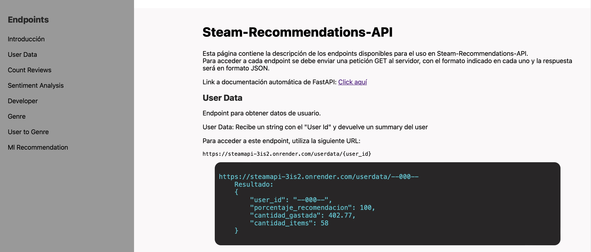

# **STEAM VIDEOGAMES RECOMMENDER SYSTEM**
[Access the Live Demo](https://steamapi-3is2.onrender.com)
#### *by Kimberly Negrette Bohórquez*

**Para la versión en español, haga clic [aquí](README_es.md)**

---

## **Introduction:**

Welcome to the Steam Videogames Recommender System. Designed with gamers in mind, this platform helps users discover new games on Steam by offering tailored recommendations. Using machine learning and data analysis, the system provides insights based on game attributes.

Through our API, users can:
- Explore detailed user profiles.
- Analyze game reviews over selected periods.
- Understand sentiments behind game reviews for specific release years.
- Dive into genre-specific data and rankings.
- Track game release trends by developers.
- Receive personalized game suggestions based on game IDs.

Dive in, explore, and let this tool guide you to your next favorite game on Steam.

---

## **Project Components**

### **1. Datasets**

Original datasets can be downloaded from this [Link](https://drive.google.com/drive/folders/1HqBG2-sUkz_R3h1dZU5F2uAzpRn7BSpj).

### **2. ETL Process**

The ETL process includes:  

- Loading data from JSON files using  and  library.
- De-nesting columns and handling missing values.
- Removing duplicates and unnecesary columns.
- Formatting and cleaning various column types.
- Generate dummy variables for categorical columns.
- Applying Natural Language Processing (NLP) on user reviews to categorize comments as positive, negative, or neutral.

Refer to the following files for detailed processes:

- [01_data_engineering.ipynb](./01_data_engineering.ipynb)
- [02_nlp_sentiment_nltk.py](./02_nlp_sentiment_nltk.py)

### **3. Exploratory Data Analysis (EDA)**

The EDA involved a deep examination of each column in the transformed dataset. We identified biases, outliers, imbalances, and potential key variables for the recommendation model.

For detailed analysis, refer to:

- [03_eda.ipynb](./03_eda.ipynb)
- [03_output_eda_games.html](./03_output_eda_games.html)
- [03_output_eda_user_items.html](./03_output_eda_user_items.html)
- [03_output_eda_user_reviews.html](./03_output_eda_user_reviews.html)

### **4. Videogame Recommender System**
After the dataset was prepared, transformed, and explored, we began the phase of creating the machine learning model to recommend videogames from the Steam platform, utilizing the  library.

This recommendation system was developed using the **"Content-based Filtering"** technique. The goal is to suggest similar videogames based on their features.

- **Data Preprocessing**: We used a dataset that contains a detailed profile for each video game, termed "profile". This profile might include details such as genre, tags, developer, and other game attributes.
- **Vectorization**: We transformed the text from the profile column into a numeric matrix using **TfidfVectorizer**. This helps in representing significant words of each game numerically. We limited this representation to the 5,000 most relevant words to keep the model manageable.
- **Recommendation Model**: We employed the **k-NN (k-Nearest Neighbors)** algorithm to identify similar games. In this case, **'cosine'** was chosen as the distance metric since it's suitable for comparing text vectors. When seeking recommendations, the system will identify the 5 games most similar to the game of interest.
The model was run for all elements of the dataframe and loaded into the API to reduce the response time to less than 1 second.

For the details and code of the recommendation system, refer to 

- [04_ml_model.ipynb](04_ml_model.ipynb).

### **5. API Endpoints and Features**

Within a  virtual environment, we developed seven functions for the endpoints that will be accessed through the API. These functions were made available using the  framework.

Additionally, we created a [documentation page](https://steamapi-3is2.onrender.com) that describes the purpose and functionality of each endpoint, serving as a guide for future users.

Here are the primary functions of the API:

1. **userdata(User_ID)**: Retrieve user-specific data, such as game recommendation percentage, total expenditure, and the number of games in their inventory.
2. **countreviews(Start_Date, End_Date)**: For a given date range, return the number of reviews generated and the percentage of recommended games during that period.
3. **sentimentanalysis(Year)**: Given a release year, return the sum of positive, negative, and neutral reviews for titles released in that year.
4. **genre(Genre)**: Input a game genre to receive a ranking based on playtime compared to other genres.
5. **userforgenre(Genre)**: Input a genre to get the Top 5 players with the most hours in that game genre.
6. **developer(Developer_Name)**: Input a game developer's name to receive a yearly list of releases, including the total games launched and the percentage of free-to-play games.
7. **game_recommendations(Game_ID)**: Input a game ID to get the game title and a list of the top 5 recommended games with their titles and IDs.

Detailed information about the API's creation and endpoints can be found in:
- [main.py](./main.py)
- [05_consultas_endpoints.ipynb](./05_consultas_endpoints.ipynb)
- [06_transform_functions.py](./06_transform_functions.py)

### **6. Setting Up Locally**
To use the Python virtual environment locally, follow these steps:
    # Install virtualenv
    pip install virtualenv

    # Create and activate the virtual environment
    python -m venv venv
    venv\Scripts\activate

    # Install the required packages
    pip install -r requirements.txt

    # Launch the FastAPI server
    uvicorn main:app --reload

### **7. Deployment**

The application has been deployed on the  platform. Access it [here](https://steamapi-3is2.onrender.com)