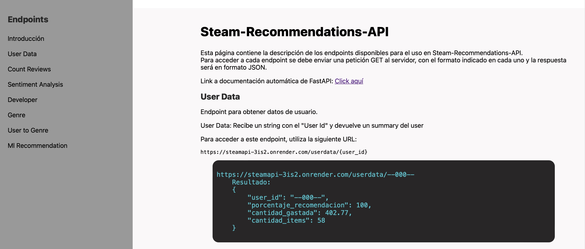

# **STEAM VIDEO GAMES RECOMMENDER SYSTEM**
[Access the Live Demo](https://steamapi-3is2.onrender.com)
#### *by Kimberly Negrette Bohórquez*

**For english version, clic [here](README.md)**

## **Introducción:**

Bienvenido al Sistema de Recomendación de Videojuegos de Steam! Diseñado pensando en los jugadores, esta plataforma ayuda a los usuarios a descubrir nuevos juegos en Steam ofreciendo recomendaciones personalizadas. Utilizando aprendizaje automático y análisis de datos, el sistema proporciona recomendaciones basadas en atributos de los juegos.

A través de nuestra API, los usuarios pueden además realizar consultas como:
- Explorar perfiles de usuario detallados.
- Analizar reseñas de juegos durante períodos seleccionados.
- Comprender los sentimientos detrás de las reseñas de juegos para años específicos de lanzamiento.
- Sumergirse en datos y rankings específicos del género.
- Seguir las tendencias de lanzamiento de juegos por desarrolladores.
- Recibir sugerencias de juegos personalizadas basadas en IDs de juegos.

Adéntrate, explora y deja que esta herramienta te guíe a tu próximo juego favorito en Steam.

---

## **Componentes del Proyecto**

### **1. Datasets**

Los conjuntos de datos originales pueden ser descargados desde este [Enlace](https://drive.google.com/drive/folders/1HqBG2-sUkz_R3h1dZU5F2uAzpRn7BSpj).

### **2. Proceso ETL**

El proceso ETL incluye:
- Carga de datos desde archivos JSON utilizando  y la biblioteca .
- Desanidación de columnas y manejo de valores faltantes.
- Eliminación de duplicados y columnas innecesarias.
- Formateo y limpieza de diferentes tipos de columnas.
- Generación de variables dummy para columnas categóricas.
- Aplicación de Procesamiento de Lenguaje Natural (NLP) en reseñas de usuarios para categorizar comentarios como positivos, negativos o neutrales.

Consulta los siguientes archivos para ver los procesos detallados:

- [01_data_engineering.ipynb](./01_data_engineering.ipynb)
- [02_nlp_sentiment_nltk.py](./02_nlp_sentiment_nltk.py)

### **3. Análisis Exploratorio de Datos (EDA)**

El EDA implicó un examen profundo de cada columna en el conjunto de datos transformado. Se identificaron sesgos, valores atípicos, desbalances y posibles variables clave para el modelo de recomendación.

Para un análisis detallado, consulta:

- [03_eda.ipynb](./03_eda.ipynb)
- [03_output_eda_games.html](./03_output_eda_games.html)
- [03_output_eda_user_items.html](./03_output_eda_user_items.html)
- [03_output_eda_user_reviews.html](./03_output_eda_user_reviews.html)

### **4. Sistema de Recomendación de Videojuegos**

Una vez el conjunto de datos fue preparado, transformado y explorado, comenzamos la fase de creación del modelo de aprendizaje automático para recomendar videojuegos de la plataforma Steam, utilizando la biblioteca .

Este sistema de recomendación fue desarrollado utilizando la técnica **"Filtrado basado en contenido"**. El objetivo es sugerir videojuegos similares basados en sus características.

- **Preprocesamiento de Datos**: Usamos un conjunto de datos que contiene un perfil detallado para cada videojuego, llamado "profile". Este perfil puede incluir detalles como género, etiquetas, desarrollador y otros atributos del juego.
- **Vectorización**: Transformamos el texto de la columna de perfil en una matriz numérica usando **TfidfVectorizer**. Esto ayuda a representar palabras significativas de cada juego de manera numérica. Limitamos esta representación a las 5,000 palabras más relevantes para mantener el modelo manejable.
- **Modelo de Recomendación**: Empleamos el algoritmo **k-NN (k-Vecinos Más Cercanos)** para identificar juegos similares. En este caso, se eligió **'cosine'** como métrica de distancia ya que es adecuada para comparar vectores de texto. Al buscar recomendaciones, el sistema identificará los 5 juegos más similares al juego de interés.

El modelo se ejecutó para todos los elementos del dataframe y se cargó en la API para reducir el tiempo de respuesta a menos de 1 segundo.

Para los detalles y código del sistema de recomendación, consulta:

- [04_ml_model.ipynb](04_ml_model.ipynb)

### **5. Endpoints y Características de la API**

Dentro de un entorno virtual , desarrollamos siete funciones para los endpoints que serán accedidos a través de la API. Estas funciones se hicieron disponibles utilizando el marco .

Además, creamos una [página de documentación](https://steamapi-3is2.onrender.com) que describe el propósito y la funcionalidad de cada endpoint, sirviendo como guía para futuros usuarios.

Aquí están las principales funciones de la API:

1. **userdata(User_ID)**: Recuperar datos específicos del usuario, como el porcentaje de recomendación de juegos, el gasto total y el número de juegos en su inventario.
2. **countreviews(Start_Date, End_Date)**: Para un rango de fechas dado, devuelve el número de reseñas generadas y el porcentaje de juegos recomendados durante ese período.
3. **sentimentanalysis(Year)**: Dado un año de lanzamiento, devuelve la suma de reseñas positivas, negativas y neutrales para títulos lanzados en ese año.
4. **genre(Genre)**: Introduce un género de juego para recibir un ranking basado en el tiempo de juego comparado con otros géneros.
5. **userforgenre(Genre)**: Introduce un género para obtener los 5 jugadores principales con más horas en ese género de juego.
6. **developer(Developer_Name)**: Introduce el nombre de un desarrollador de juegos para recibir una lista anual de lanzamientos, incluyendo el total de juegos lanzados y el porcentaje de juegos gratuitos.
7. **game_recommendations(Game_ID)**: Introduce un ID de juego para obtener el título del juego y una lista de los 5 juegos recomendados principales con sus títulos e IDs.

La información detallada sobre la creación y endpoints de la API se puede encontrar en:
- [main.py](./main.py)
- [05_consultas_endpoints.ipynb](./05_consultas_endpoints.ipynb)
- [06_transform_functions.py](./06_transform_functions.py)

### **6. Configuración en Local**

Para usar el entorno virtual de Python localmente, sigue estos pasos:
    # Instalar virtualenv
    pip install virtualenv

    # Crear y activar el entorno virtual
    python -m venv venv
    venv\Scripts\activate

    # Instalar los paquetes requeridos
    pip install -r requirements.txt

    # Iniciar el servidor FastAPI
    uvicorn main:app --reload

### **7. Despliegue**

La aplicación ha sido desplegada en la plataforma . Accede a ella [aquí](https://steamapi-3is2.onrender.com).
